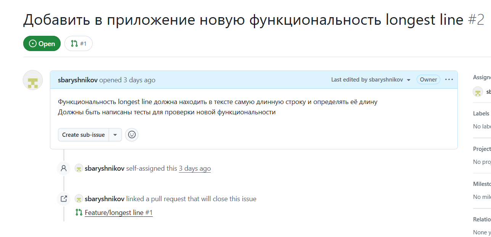
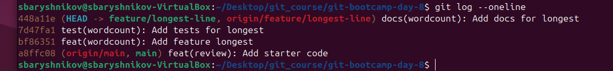
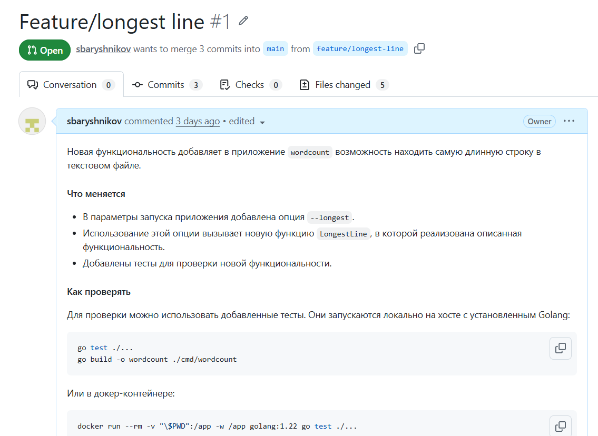
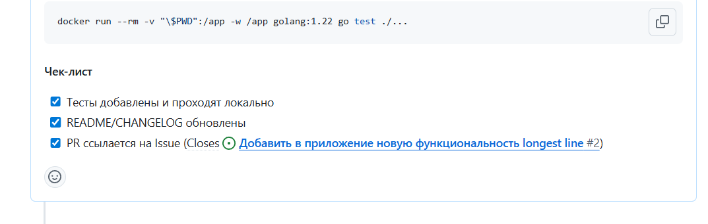
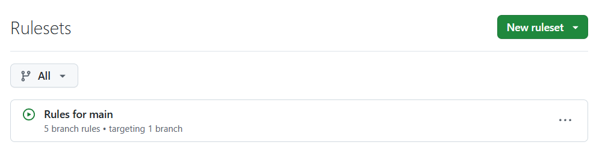

# LAB — день 8

## Базовая задача — `01-pr-and-review`

### Ссылки

| Что | URL |
|-----|-----|
| Репозиторий | https://github.com/sbaryshnikov/git-bootcamp-day-8.git |
| Issue | https://github.com/sbaryshnikov/git-bootcamp-day-8/issues/2 |
| Pull Request | https://github.com/sbaryshnikov/git-bootcamp-day-8/pull/1 |

### Скриншоты (обязательные)

1. **Issue** — страница с текстом задачи:



2. **История feature-ветки** — `git log --oneline feature/<slug>`, видны 3 CC-коммита:



3. **Pull Request** — заполненный template (Описание / Что меняется / Как проверять / Чек-лист):



4. **Привязка к Issue** — `Closes #N` в описании или блок Linked issues:



### Скриншоты (опциональные)

5. **Protection rules** на `main` (если настраивали):




### Команды

```bash
# git switch -c feature/longest-line
# git add cmd/wordcount/main.go internal/stats/longest.go && git commit -m "feat(wordcount): Add feature longest"
# git add internal/stats/longest_test.go && git commit -m "test(wordcount): Add tests for longest"
# git add && git commit -m "docs(wordcount): Add docs for longest"
```

### Впечатления (2–3 предложения)

Принципиально нового ничего не узнал, но упорядочил и закрепил уже имеющиеся знания о работе с PR 

### Protection rules (опционально)

Включил запрет на удаление main, запрет на коммит в main без PR, запрет на force push, необходимость сканирования и проверки code quality
